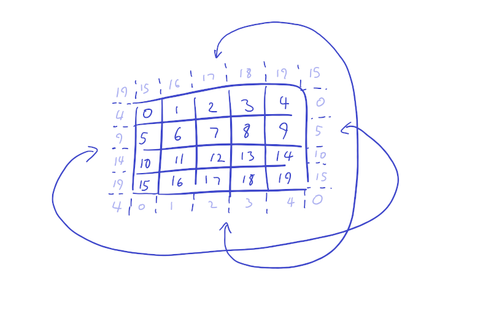

# COMP1110 Lab 6

This lab contains material from module [**O5**](https://cs.anu.edu.au/courses/comp1110/lectures/oo/#O5) (Abstract Classes), [**J14**](https://cs.anu.edu.au/courses/comp1110/lectures/java/#J14) (Collections), and [**X1**](https://cs.anu.edu.au/courses/comp1110/lectures/javafx/) (JavaFX).

## Before the Lab

* Complete Week 7 of your personal journal, commit and push at least 5 minutes before your lab.

## Purpose

In this lab, you will complete an object-oriented implementation of a simple agent-based simulation.

**Your tutor will mark your engagement during the lab.**

## Part I: 30-Minute Check-In

As usual, you will do _two_ things during the 30-minute check-in:

1.  Check in with **your tutor** together with the other members of your group.    Briefly outline any issues you're having that you'd particularly like help with during the lab (make sure you have your journal open and refer to it when you meet with your tutor).
2.  When you're not checking in with your tutor, you should be listening to the **lab leader** as they give an overview of what you'll be working through in this week's lab.

## Part II:  Your Lab Tasks

### Rabbits and Foxes

In this task, you will implement an agent-based simulation of a simple ecosystem containing three different kinds of organisms: grass, rabbits, and foxes.
Agents move over a grid of discrete locations, each containing some grass and at most one animal.
Each of these organisms behaves according to a simple set of rules.

*Grass* grows at every location where an animal is not present.

*Rabbits* move randomly to empty locations and eat grass.

*Foxes* move randomly, preferentially moving to neighbouring locations where there are rabbits and eating them.

Animals (both rabbits and foxes) reproduce whenever they are not hungry.

The locations in the world are laid out on a Cartesian grid.
Each location has an x and a y coordinate, and eight neighbouring locations, which are those locations with x and y coordinates that differ by no more than 1.
The world has [periodic boundary conditions](https://en.wikipedia.org/wiki/Periodic_boundary_conditions), which means that if an animal moves off the right-hand edge of the grid (`x == world.sizeX`), it reappears on the left-hand edge (`x == 0`) and vice-versa, and if an animal moves off the bottom edge of the grid (`y == world.sizeY`), it reappears on the bottom edge (`y == 0`) and vice-versa.
The boundary conditions are shown for an example 5x4 grid in the diagram below; for example, location 15 has neighbouring locations {14,10,11,19,16,4,0,1}.

The class [World.java](World.java) contains an incomplete implementation of the simulation; Javadoc in this class defines the rules for each type of organism.
You should complete the methods marked "FIXME".

Note: you should read all the provided code before making changes.
Many of the rules are already implemented, including the rules for reproduction and starvation (in the methods `Animal.reproduce()` and `World.update()` respectively).

We have provided a [complete GUI](WorldGUI.java) to visualize the simulation results.
Unfortunately, this GUI requires the world to be represented via a simple String interface.
You must complete the `World.getCurrentState()` method to convert from the internal (object-oriented) structure into the String representation that the GUI requires; the Javadoc for this method contains a full description of the String interface.
We have also provided a set of unit tests for each of the methods you need to complete, which you can run by selecting  the `L6 WorldTest` configuration from the **Run Configuration** menu and clicking  **Run**.

### Extension: Cellular Automata

This simulation may remind you of [Conway's Game of Life](https://en.wikipedia.org/wiki/Conway%27s_Game_of_Life), which is a [cellular automaton](https://en.wikipedia.org/wiki/Cellular_automaton) with very simple rules which give rise to complex 'lifelike' behaviours.
While our simulation rules are described in terms of agents, it is possible to define an equivalent cellular automaton.
Can you create an alternative `World` implementation as a cellular automaton and connect it to the `WorldGUI` for visualization?
Which representation do you find more pleasing, and why?

### Further Reading: Ecosystem Modelling

Our simulation is a simple example of an [agent-based ecosystem model](https://en.wikipedia.org/wiki/Agent-based_model_in_biology) containing predator and prey species.
This agent-based model is a variation of [Lotka-Volterra predator-prey interactions](https://www.cs.unm.edu/~forrest/classes/cs365/lectures/Lotka-Volterra.pdf); the use of agents allows for discrete populations and non-uniform mixing of predators and prey.

Try playing around with the values of certain parameters in the system, for example, `MAX_GRASS`, `MAX_HUNGER`, or the changes in hunger in rabbits and foxes due to consuming or not consuming other organisms.
You may find that small changes in the simulation rules lead to large and surprising changes in behaviour.

### Work on your group assignment

Use any spare time to work on your group assignment.
